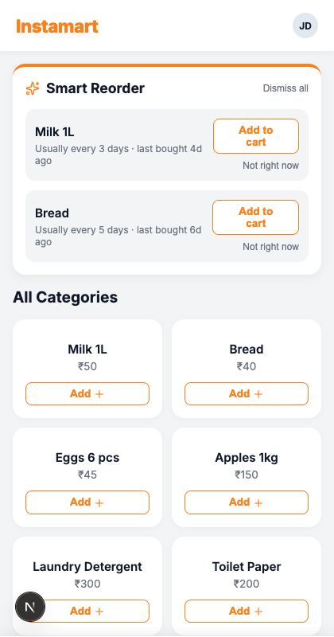
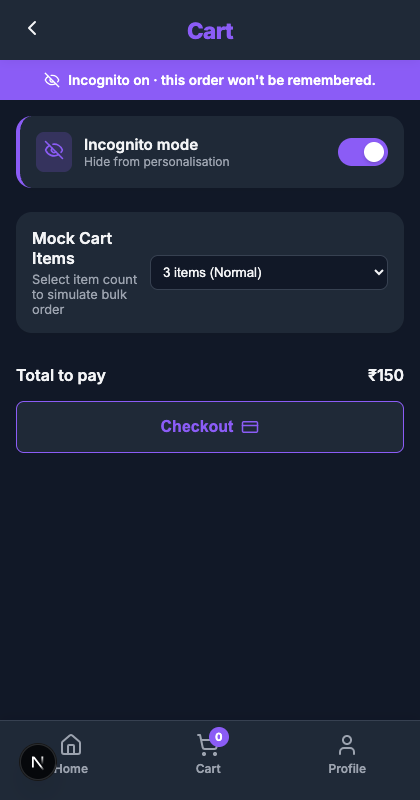
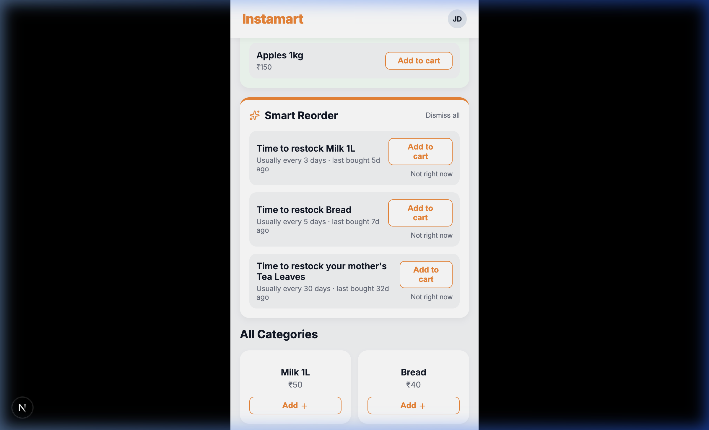
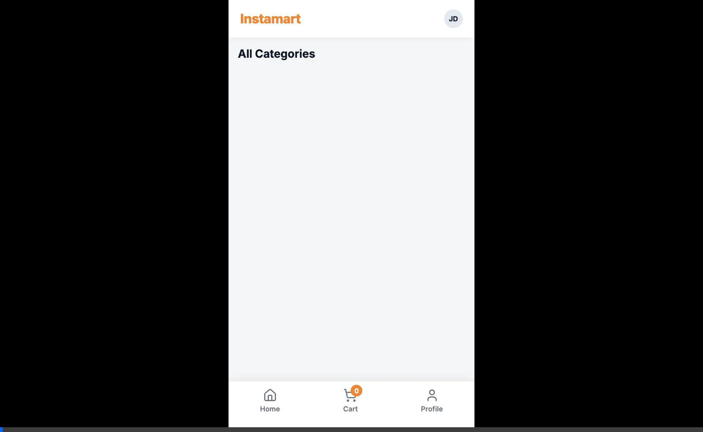
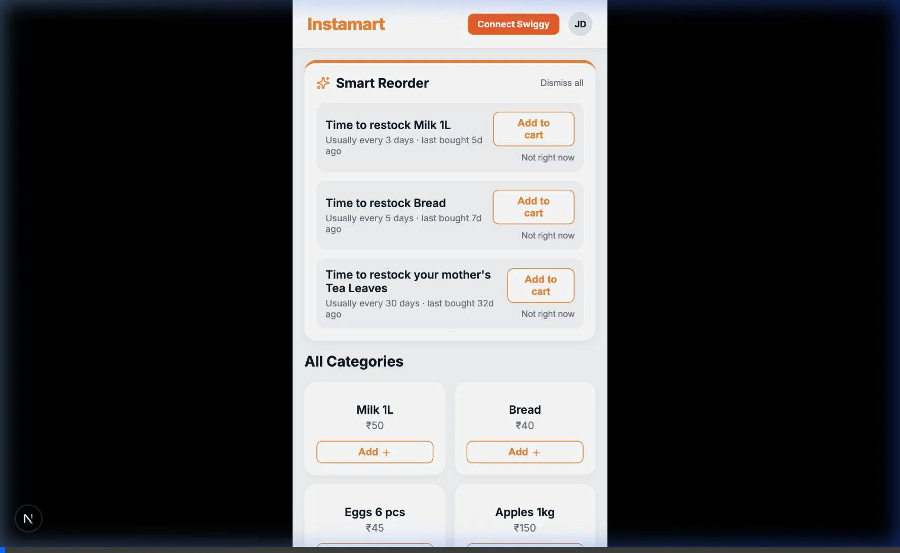

# Smart Reorder MVP

Smart Reorder is a personalised nudge engine layered on top of a grocery purchase history. It surfaces the right items at the right time, learns a user's rhythm, handles bulk-order anomalies gracefully, and offers a private incognito mode for sensitive purchases.

This MVP is built for a mobile-first grocery app (like Instamart or Kirana) based on a Product Requirements Document (PRD).

## Key Features

1. **In-app Nudge Card**: Proactively suggests items you usually buy. Supports multi-user households by personalizing nudges for specific sub-profiles (e.g., "Mother's tea leaves").
2. **Anomaly Detection & Party Mode**: Detects unusually large orders at checkout to categorize them (e.g., "House Party"). Later, if your cart contents match a past anomaly, "Party Mode" is triggered to suggest the rest of the items from that event!
3. **Incognito Mode**: Buy items privately without them influencing your personalisation profile.
4. **Swiggy MCP Integration**: Uses the Model Context Protocol to seamlessly connect to your live Swiggy account via OAuth 2.1.

## Tech Stack

- **Frontend**: Next.js (React), Vanilla CSS (Mobile-first design)
- **Backend**: Next.js App Router API Routes
- **Database**: SQLite (via Prisma ORM)

## Screenshots

### Home & Nudge Card
The nudge card appears on the home feed when you have items that are overdue based on your normal buying rhythm. Now supports sub-profiles like "Mother's tea leaves".



### Cart & Incognito Mode
A toggle in the cart allows you to activate incognito mode. The theme shifts, and purchases in this session won't impact your future nudges.



### Anomaly Bottom Sheet
If you check out with significantly more items than your 90-day average, an anomaly sheet surfaces to categorize the bulk order.

### Party Mode (Cart Similarity)
If you add a few items that match a previously categorized anomaly (like a "House Party"), a Party Mode suggestion card appears to help you quick-add the rest!



### Live Demos
**Full Feature Demo:**


**Swiggy MCP OAuth Connect Flow:**


## Getting Started

1. Install dependencies:
   ```bash
   npm install
   ```

2. Push the schema and seed the database:
   ```bash
   npx prisma db push
   node prisma/seed.js
   ```

3. Run the development server:
   ```bash
   npm run dev
   ```

4. **Configure Swiggy MCP (Optional)**: To use real Swiggy account data instead of the local SQLite DB, create a `.env` file in the root directory and add your Client ID:
   ```env
   SWIGGY_CLIENT_ID=your_client_id_here
   ```
   If not set, the app will use a mock OAuth flow and local data fallback.

5. Open `http://localhost:3000` in your browser.

## Database Schema Highlights

- `UserItemProfile`: Tracks the `avg_days_between` purchases and the `next_nudge_at` date for each SKU.
- `SessionEvent`: Captures the checkout context, including `is_incognito` and `item_count`.
- `AnomalySession`: Records when an anomaly occurs and suppresses nudges until a specific time.
